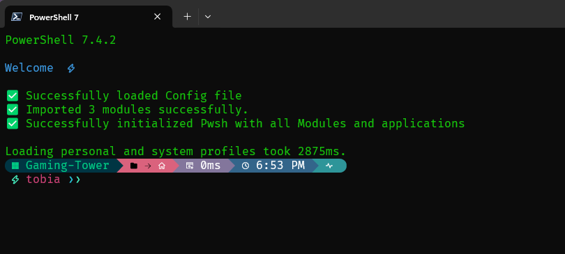

# Contents
- [Contents](#contents)
- [Personal PowerShell Configuration 🖥️](#personal-powershell-configuration-️)
  - [TL:DR](#tldr)
  - [Features 🌟](#features-)
  - [Showcase 🌟](#showcase-)
  - [Components Installed 🛠️](#components-installed-️)
  - [Configuration 📁](#configuration-)
  - [Usage 🚀](#usage-)
  - [Supported Linux Commands 🐧](#supported-linux-commands-)
  - [Contributing 🤝](#contributing-)
  - [Personalization 🎨](#personalization-)
  - [License 📜](#license-)


----

# Personal PowerShell Configuration 🖥️

This repository contains a collection of PowerShell scripts tailored to enhance the command-line experience on Windows systems. 
Developed for personal use, feel free to use, fork, and customize this as you like. 🚀
Note: Loading this profile may take 2-4 seconds, in the future, support for local cache will be implemented.

## Disclaimer: ⚠️
Never directly inject any code from the World-Wide-Web into your devices, that you have not read through and verified it's safe!

## TL:DR
- Paste this into your Powershell and afterwards into your $PROFILE, with the command `notepad $PROFILE`:
```bash
iex (iwr "https://raw.githubusercontent.com/CrazyWolf13/unix-pwsh/main/Microsoft.PowerShell_profile.ps1").Content
```

## Features 🌟
- **Bash-like Shell Experience**: Mimics Unix shell functionality, bringing familiarity to Windows PowerShell. 🐧
- **Oh My Posh Integration**: Enhances the user interface with stylish prompts and Git status indicators. ⚡
- **Deferred Loading**: Improves function loading time for a smoother experience. 🕒
- **Automatic Installation**: The scripts automatically install necessary modules and components on first execution. 🛠️

## Showcase 🌟
Here is an image, how the finished config looks like, but this can be easily changed, via OhMyPosh.
However, this preview is not so meaningful, as most of the visual configuration is done by OhMyPosh.



## Components Installed 🛠️
- **Terminal-Icons Module**: Enhances terminal UI with icons. 🎨
- **Powershell-Yaml**: Facilitates configuration with a YAML file, saving time. 📝
- **PoshFunctions**: Essential functions for PowerShell. ⚙️
- **FiraCode Nerd Font**: Installs a stylish font for code readability. 🅰️
- **Oh My Posh**: Provides customizable prompt themes. 🎨

## Configuration 📁
- The configuration file is located at: `~/pwsh_custom_config.yml`. This file stores all the configuration variables, facilitating faster loading by eliminating the need to check for installed elements every time.

- All configurable options, including module installation preferences and feature toggles, are centralized within this YAML file. This centralized approach streamlines the initialization process, ensuring a quicker and more efficient startup experience. 🚀

## Usage 🚀
- To activate this configuration:
1. Paste in this command: `iex (iwr "https://raw.githubusercontent.com/CrazyWolf13/unix-pwsh/main/Microsoft.PowerShell_profile.ps1").Content`.
2. The PowerShell profile is automatically created and the profile injected into, if it does not exist. If it exists, manually place the snippet provided above at the top of the PowerShell profile.
3. Edit the profile easily by typing `notepad $PROFILE` into PowerShell. 🛠️
4. Make sure to point Windows Terminal to `pwsh` instead of `powershell`, as `pwsh` is the open-sourced 7.x.x version of PowerShell (PowerShell Core). 🔄
5. Enjoy the enhanced PowerShell experience! 🎉

## Supported Linux Commands 🐧
The PowerShell profile includes aliases and functions that mimic common Linux commands, providing a familiar environment for users accustomed to Linux shell environments. Here are some of the supported Linux commands:

- `sudo`: Runs a command with elevated privileges, similar to the sudo command in Linux.
- `cd`: Changes the current directory. PowerShell equivalent: `Set-Location`.
- `ls`: Lists the contents of a directory. PowerShell equivalent: `Get-ChildItem`.
- `dirs`: Lists directories recursively.
- `sed`: Stream editor for filtering and transforming text.
- `which`: Locates a command.
- `export`: Sets environment variables. PowerShell equivalent: `Set-Item`.
- `pgrep`: Searches for processes by name. PowerShell equivalent: `Get-Process`.
- `grep`: Searches for patterns in files.
- `pkill`: Terminates processes by name.
- `head`: Displays the beginning of a file.
- `tail`: Displays the end of a file. 
- `unzip`: Extracts files from a zip archive. PowerShell equivalent: function `expand-archive`.
- `du`: Displays disk usage statistics.
- `ll`: Lists files in a directory.
- `df`: Displays disk space usage. PowerShell equivalent: `Get-Volume`.
- `reboot`: Reboots the system. 
- `poweroff`: Shuts down the system. 
- `cd...`: Changes the directory to the parent's parent directory.
- `cd....`: Changes the directory to the parent's parent's parent directory.
- `md5`: Computes the MD5 hash of a file.
- `sha1`: Computes the SHA1 hash of a file.
- `sha256`: Computes the SHA256 hash of a file.
- `uptime`: Displays system uptime.
- `ssh-copy-key`: Copies SSH public keys to a remote server.
- `explrestart`: Restarts Windows Explorer.
- `expl`: Opens File Explorer at the currenct location.
- `Get-PubIP`: Retrieves the public IP address.
- `Get-PrivIP`: Retrieves the private IP address.
- `gitpush`: Also known as lazy-git, pulls, adds all, commits the message after gitpush and then pushes.
- `ptw`: Send text/files pipe output to a wastebin server, important: contact me via issue for this.

## Contributing 🤝
- Feel free to fork, modify, and contribute improvements or additional features.
- For any issues, questions, or help, please create an issue in the repository. 💬

## Personalization 🎨
- Customize the scripts according to personal preferences or specific system requirements.
- To use a forked version, update the `githubUser` variable to point to your own forked repository.
- To make your own name appear on the Welcome Screen, just fork this repo and edit the main file located in the pwsh folder and edit the variable `$name` to your own name.
- To insert your own OhMyPosh config, just fork the repo and change the URL in the main file to your own.

## License 📜
This project is licensed under the [MIT License](LICENSE).


---

*Developed by CrazyWolf13 with ❤️*
